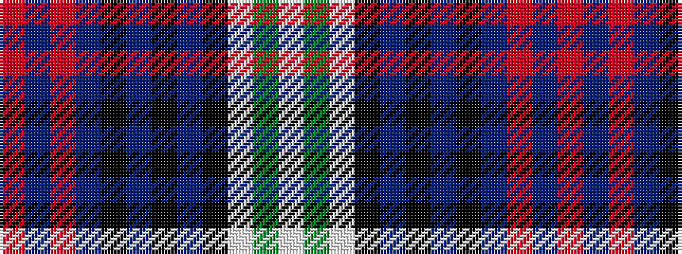

RBRBKBKBKWGW

It is a 12 stripe tartan.

<figure class="pat-woven">

<figcaption>idealised sample</figcaption>
</figure>

## Colour Sequence



## Tartans with this colour sequence

| Tartans |
|---------------|
| [Sutherland Dress, Old (Dance)](/setts/s12/w6dg2w27k10n4k4n4k4n15r2n2r4~x2/)|
||
| [Sutherland, Dress](/setts/s12/w5g2w23k7db4k3db3k3db11r2db2r3~x2/)|
||
