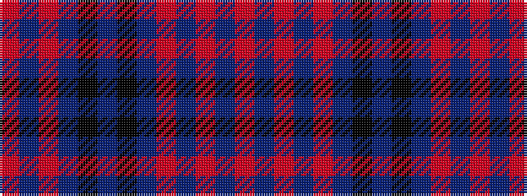

RBRBKBKBRBRBR

It is a 13 stripe tartan.

<figure class="pat-woven">

<figcaption>idealised sample</figcaption>
</figure>

## Colour Sequence



## Tartans with this colour sequence

| Tartans |
|---------------|
| [Balmoral Hotel (Corporate)](/setts/s13/o15db2o2db2o2dt12k12dt3k12dt12o12db2o2~x2/)|
||
