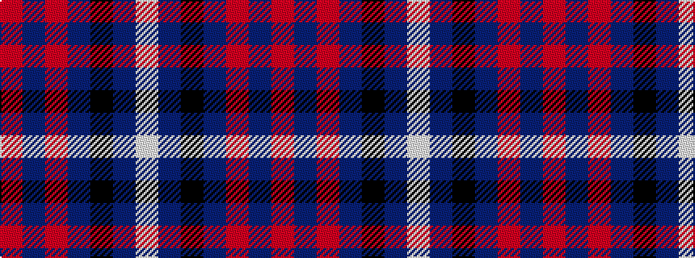

RBRBKBW

It is a 7 stripe tartan.

<figure class="pat-woven">

<figcaption>idealised sample</figcaption>
</figure>

## Colour Sequence



## Tartans with this colour sequence

| Tartans |
|---------------|
| [First (Corporate)](/variants/s7/m4dp1m1dp12k6dt16w1~x2/)|
||
| [Heritage of Wales (Fashion)](/variants/s7/r10db4r6db30k10db5w2~x2/)|
||
