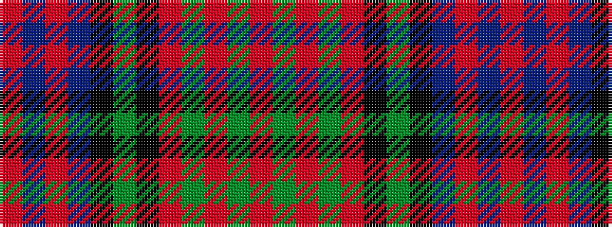

RBRBKGKRGRGR

It is a 12 stripe tartan.

<figure class="pat-woven">

<figcaption>idealised sample</figcaption>
</figure>

## Colour Sequence



## Tartans with this colour sequence

| Tartans |
|---------------|
| [Kinloch Anderson #2 (Corporate)](/variants/s12/r4y14o2y4o2k6y3k6db12r2db4r4~x2/)|
||
| [Kinloch Anderson, hunting](/variants/s12/m4g14o2g4o2k6g3k6db14m2db4m4~x2/)|
||
