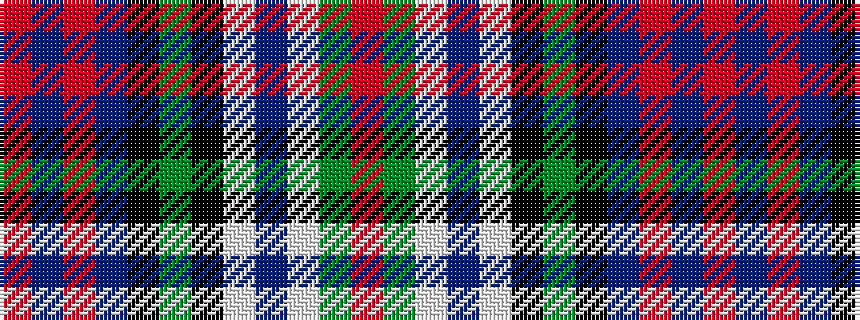

RBRBKGKWBWGR

It is a 12 stripe tartan.

<figure class="pat-woven">

<figcaption>idealised sample</figcaption>
</figure>

## Colour Sequence



## Tartans with this colour sequence

| Tartans |
|---------------|
| [Kinloch Anderson Old Dress](/variants/s12/r4y14lb2do4lb2k6y3k6db13r2db4r4~x2/)|
||
