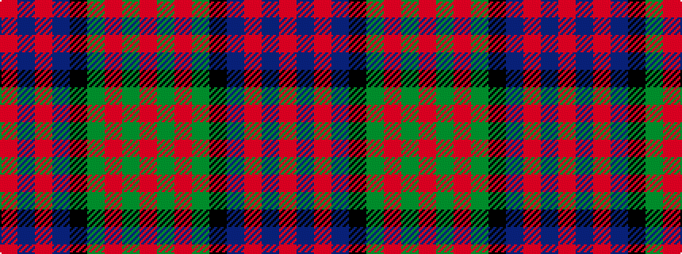

RBRBKGRGR

It is a 9 stripe tartan.

<figure class="pat-woven">

<figcaption>idealised sample</figcaption>
</figure>

## Colour Sequence



## Tartans with this colour sequence

| Tartans |
|---------------|
| [Alexander](/variants/s9/r12db2r4db4k15g4r4g2r12~x2/)|
||
| [Alexander - 1985 (Name)](/variants/s9/r12g2r4g4k15t4r4t2r12~x2/)|
||
