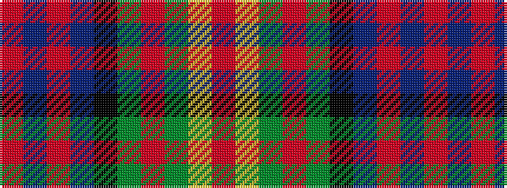

RBRBKGRGYR

It is a 10 stripe tartan.

<figure class="pat-woven">

<figcaption>idealised sample</figcaption>
</figure>

## Colour Sequence



## Tartans with this colour sequence

| Tartans |
|---------------|
| [Hard Rock Café](/setts/s10/r4do4r4do12k32dy15r1dy7ly1r1~x2/)|
||
