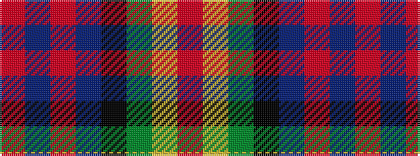

RBRBKGYR

It is a 8 stripe tartan.

<figure class="pat-woven">

<figcaption>idealised sample</figcaption>
</figure>

## Colour Sequence



## Tartans with this colour sequence

| Tartans |
|---------------|
| [MacDonald of Borrodale (Clan)](/setts/s8/r6db3r3db32k30g30ly3r3~x2/)|
||
