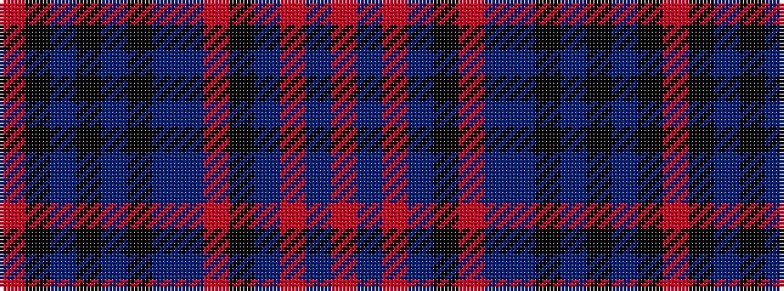

RBRBKRBBKBKBKR

It is a 14 stripe tartan.

<figure class="pat-woven">

<figcaption>idealised sample</figcaption>
</figure>

## Colour Sequence



## Tartans with this colour sequence

| Tartans |
|---------------|
| [Katie Targett-Adams](/setts/s14/r2dp5r2dp10k16m6b2dpi14k1dpi14k6dp12k16m1~x2/)|
||
