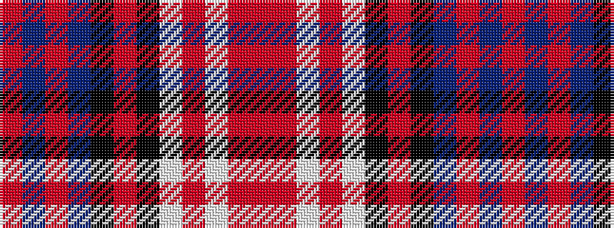

RBRBKRKWRWRR

It is a 12 stripe tartan.

<figure class="pat-woven">

<figcaption>idealised sample</figcaption>
</figure>

## Colour Sequence



## Tartans with this colour sequence

| Tartans |
|---------------|
| [Kinloch Anderson, dress](/setts/s12/r4o14w2o4w2k6o3k6db14r2db4r4~x2/)|
||
