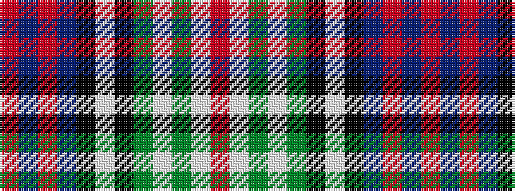

RBRBKWKGWGWR

It is a 12 stripe tartan.

<figure class="pat-woven">

<figcaption>idealised sample</figcaption>
</figure>

## Colour Sequence



## Tartans with this colour sequence

| Tartans |
|---------------|
| [Kinloch Anderson Dress](/setts/s12/r8w30y5w8y5k12w6k12db28r4db8r8/)|
||
