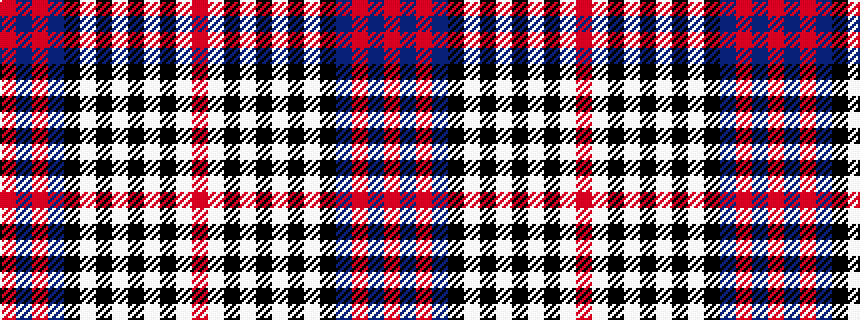

RBRBKWKWKWKWR

It is a 13 stripe tartan.

<figure class="pat-woven">

<figcaption>idealised sample</figcaption>
</figure>

## Colour Sequence



## Tartans with this colour sequence

| Tartans |
|---------------|
| [Hogmany Plaid](/variants/s13/r4w13k6w6k6w6k5w1k24dt28r2dt2r4~x2/)|
||
