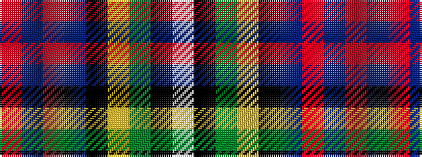

RBRBKYGKW

It is a 9 stripe tartan.

<figure class="pat-woven">

<figcaption>idealised sample</figcaption>
</figure>

## Colour Sequence



## Tartans with this colour sequence

| Tartans |
|---------------|
| [Whitson](/setts/s9/w4k1g19ly1k19db13r2db4r2~x2/)|
||
| [Whitson (Name)](/setts/s9/lb4k1y19lo1k19n13r2n4r2~x4/)|
||
