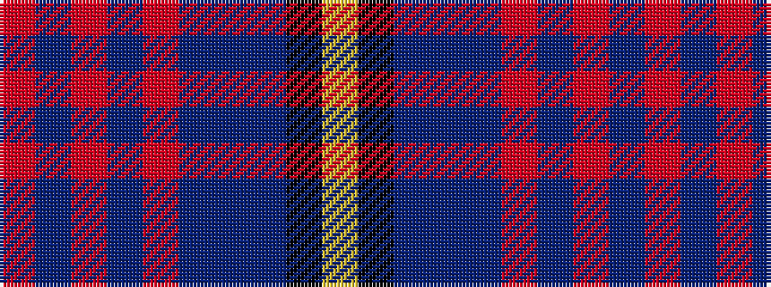

RBRBRBBBKY

It is a 10 stripe tartan.

<figure class="pat-woven">

<figcaption>idealised sample</figcaption>
</figure>

## Colour Sequence



## Tartans with this colour sequence

| Tartans |
|---------------|
| [U.S. Law Enforcement](/setts/s10/lg4k3db6dbi4db57o3db3o3db3r3~x2/)|
||
