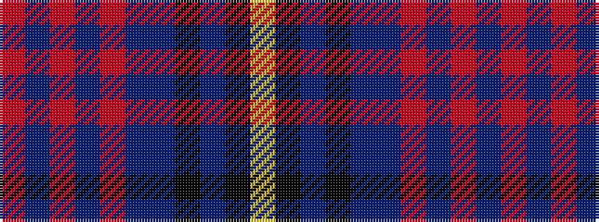

RBRBRBBKBKY

It is a 11 stripe tartan.

<figure class="pat-woven">

<figcaption>idealised sample</figcaption>
</figure>

## Colour Sequence



## Tartans with this colour sequence

| Tartans |
|---------------|
| [Wcwm 1873-4](/setts/s11/o6do1o2do2o1do4dp14k4db1k3ly1~x4/)|
||
