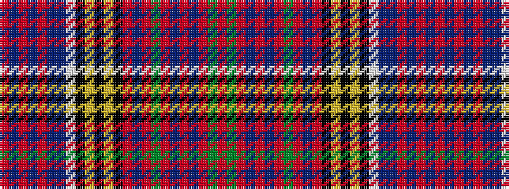

RBRBRBBWKYKYKRBRGRBRBRGR

It is a 24 stripe tartan.

<figure class="pat-woven">

<figcaption>idealised sample</figcaption>
</figure>

## Colour Sequence



## Tartans with this colour sequence

| Tartans |
|---------------|
| [Anderson (STS)](/variants/s24/r3dg6r1db1r2db1r1dg6r2db4r1k4ly1k2ly1k2w3db4t14r1db1r1t4r3~x2/)|
||
| [Anderson 3](/variants/s24/r3g6r1db1r2db1r1g6r2db4r1k4ly1k2ly1k2w3db4t14r1db1r1t4r3~x2/)|
||
