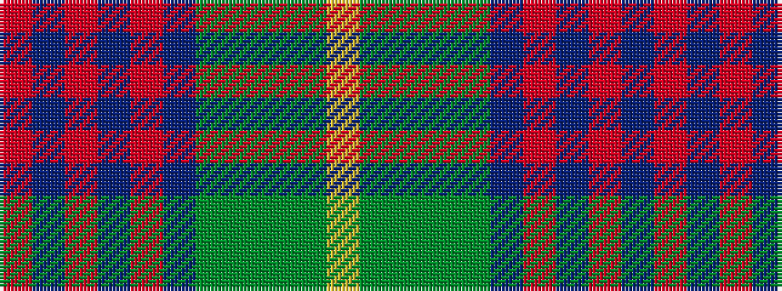

RBRBRBGGGGY

It is a 11 stripe tartan.

<figure class="pat-woven">

<figcaption>idealised sample</figcaption>
</figure>

## Colour Sequence



## Tartans with this colour sequence

| Tartans |
|---------------|
| [Isle of Skye](/variants/s11/o20dp2o2dp2o3dp8dg9g8y8dg1lr2~x2/)|
||
