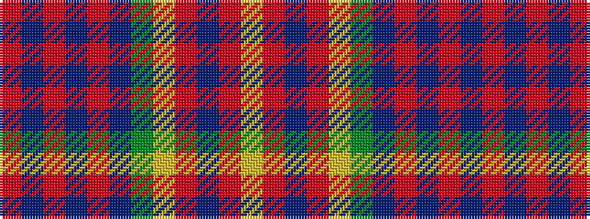

RBRBRBGYRBRY

It is a 12 stripe tartan.

<figure class="pat-woven">

<figcaption>idealised sample</figcaption>
</figure>

## Colour Sequence



## Tartans with this colour sequence

| Tartans |
|---------------|
| [Army Medical Services](/setts/s12/r16db2r2db2r2db16dg16ly1r16db16r2lr2~x2/)|
||
