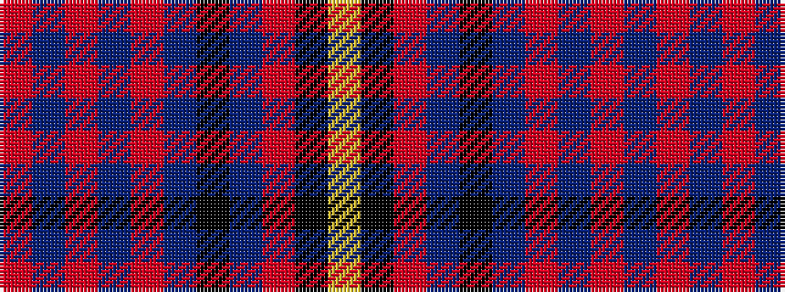

RBRBRBKBRKY

It is a 11 stripe tartan.

<figure class="pat-woven">

<figcaption>idealised sample</figcaption>
</figure>

## Colour Sequence



## Tartans with this colour sequence

| Tartans |
|---------------|
| [MacDougall - 1970 (William) (Comm)](/setts/s11/r5dti5r5dti5r5dti14k16dt14r3k3ly3~x2/)|
||
