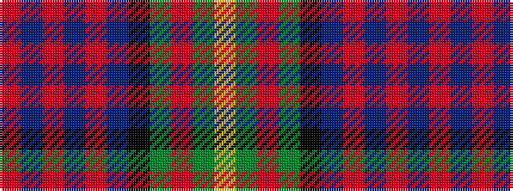

RBRBRBKGRGY

It is a 11 stripe tartan.

<figure class="pat-woven">

<figcaption>idealised sample</figcaption>
</figure>

## Colour Sequence



## Tartans with this colour sequence

| Tartans |
|---------------|
| [Logan and MacLennan](/setts/s11/r6db3r2db2r2db16k12dg16r1dg1ly2~x2/)|
||
