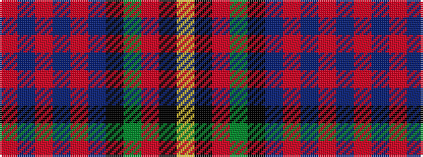

RBRBRBKGRKY

It is a 11 stripe tartan.

<figure class="pat-woven">

<figcaption>idealised sample</figcaption>
</figure>

## Colour Sequence



## Tartans with this colour sequence

| Tartans |
|---------------|
| [Logan #7](/setts/s11/r6db3r2db2r2db16k12g16r1k1ly2~x2/)|
||
| [MacLagan of Glenquiech](/setts/s11/r6db6r3db3r3db28k21g28r21k2ly4/)|
||
| [MacLennan](/setts/s11/r6db3r2db2r2db16k12dg16r1k1ly2~x2/)|
||
