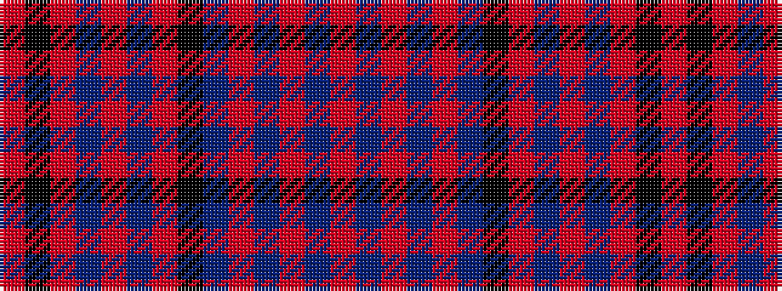

RBRBRBKRBRBRKR

It is a 14 stripe tartan.

<figure class="pat-woven">

<figcaption>idealised sample</figcaption>
</figure>

## Colour Sequence



## Tartans with this colour sequence

| Tartans |
|---------------|
| [Chisholm, Christopher (Personal)](/setts/s14/ri2dt2ri1dt2ri1dt28k6ri2b1ri2b1ri24k1r1~x2/)|
||
