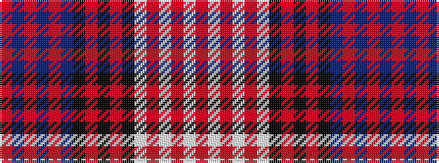

RBRBRBKRKRKWRWRWR

It is a 17 stripe tartan.

<figure class="pat-woven">

<figcaption>idealised sample</figcaption>
</figure>

## Colour Sequence



## Tartans with this colour sequence

| Tartans |
|---------------|
| [Angus Dress (Convergence 98)](/setts/s17/r2b1r1b1r1b14k14r1k3r1k14w14r1w1r1w1r2~x4/)|
||
