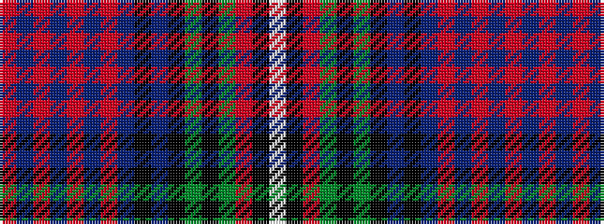

RBRBRBRBKBKGKGRKW

It is a 17 stripe tartan.

<figure class="pat-woven">

<figcaption>idealised sample</figcaption>
</figure>

## Colour Sequence



## Tartans with this colour sequence

| Tartans |
|---------------|
| [Caledonian Society of P.E.I. (Corp)](/setts/s17/r14db4r2db2r4db2r2db14k4db4k15g20k2y4r2k1w4~x2/)|
||
