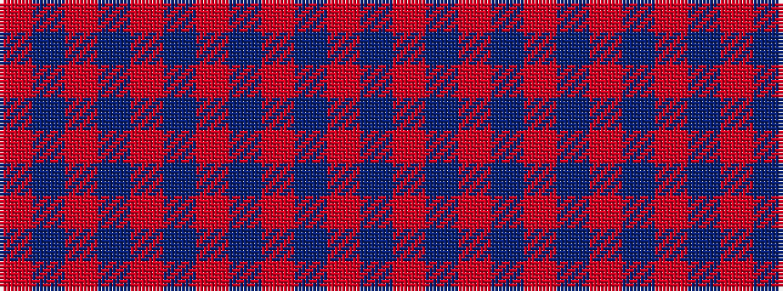

RBRBRBRBRBR

It is a 11 stripe tartan.

<figure class="pat-woven">

<figcaption>idealised sample</figcaption>
</figure>

## Colour Sequence



## Tartans with this colour sequence

| Tartans |
|---------------|
| [Bennet](/variants/s11/m64db18m2db3m2db3m14t8m2t4m2~x2/)|
||
