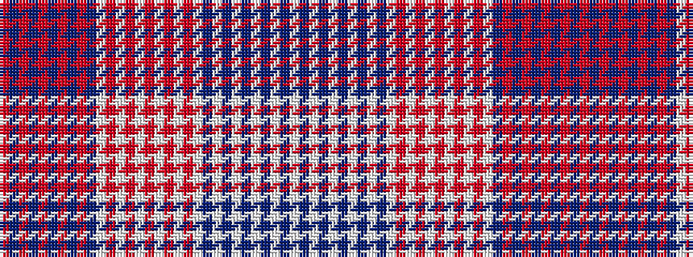

RBRBRBRBRBWRWRWRWRWRWBWBWBWBWBW

It is a 31 stripe tartan.

<figure class="pat-woven">

<figcaption>idealised sample</figcaption>
</figure>

## Colour Sequence



## Tartans with this colour sequence

| Tartans |
|---------------|
| [Wcwm 1131](/variants/s31/o10do1o1do1o1do1o1do1o1do1lb1o1lb1o1lb1o1lb1o1lb1o1lb1do1lb1do1lb1do1lb1do1lb1do1lb10~x4/)|
||
