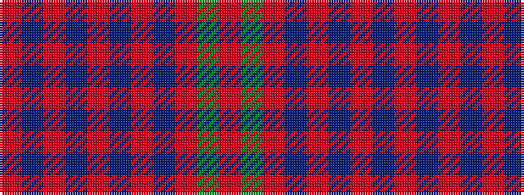

RBRBRBRBRGR

It is a 11 stripe tartan.

<figure class="pat-woven">

<figcaption>idealised sample</figcaption>
</figure>

## Colour Sequence



## Tartans with this colour sequence

| Tartans |
|---------------|
| [MacQuarrie](/setts/s11/r28g64r20db48r60t1r8t1r60db48r10~x2/)|
||
