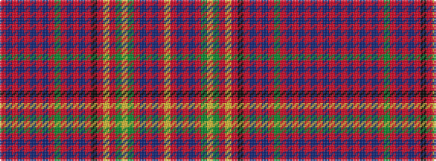

RBRBRBRBRGRBRBRKRYRGYGRBRBRY

It is a 28 stripe tartan.

<figure class="pat-woven">

<figcaption>idealised sample</figcaption>
</figure>

## Colour Sequence



## Tartans with this colour sequence

| Tartans |
|---------------|
| [MacDonald of Staffa](/setts/s28/r15db1r1db1r1db1r1db1r3dg4r1db1r3db1r1k2r3ly1r3dg2lr1dg2r1db1r3db1r6ly1~x2/)|
||
