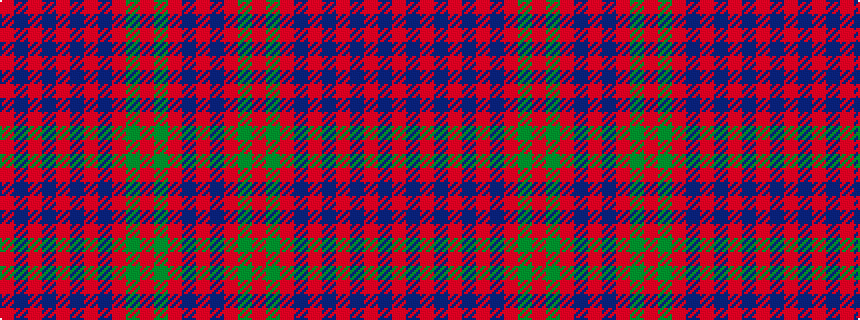

RBRBRBRBRGRGRBR

It is a 15 stripe tartan.

<figure class="pat-woven">

<figcaption>idealised sample</figcaption>
</figure>

## Colour Sequence



## Tartans with this colour sequence

| Tartans |
|---------------|
| [Drummond](/variants/s15/r6b2r2g24r2g2r2b8r2t1r32b2r2b1r6~x2/)|
||
| [Drummond - 1819 (Clan)](/variants/s15/r6dp2r2dg24r2dg2r2dp8r2t1r32dp2r2dp1r6~x2/)|
||
| [Glenfarclas Distillery](/variants/s15/o8db3o3g20o3g3o3db6o3b3o20db3o3db2o6~x2/)|
||
| [Grant](/variants/s15/r6db2r2dg24r2dg2r2db8r2b1r32db2r2db1r6~x2/)|
||
| [Grant D](/setts/r3db1r1dg10r1dg1r1db3r1b1r12db1r1db1r3/)|
||
| [Grant of Ballindalloch Clan Tartan](/variants/s15/r5dt5r3g16r3g3r3dt10r3t5r12dt5r3dt3r5~x2/)|
||
| [Grant or Drummond Clan Tartan](/variants/s15/r6db2r2g24r2g2r2db8r2t2r32db2r2db1r6~x2/)|
||
| [Grant, or Drummond](/variants/s15/r6db2r2g24r2g2r2db8r2t1r32db2r2db1r6~x2/)|
||
