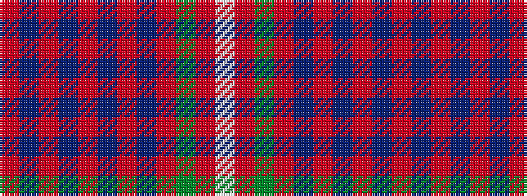

RBRBRBRBRGRW

It is a 12 stripe tartan.

<figure class="pat-woven">

<figcaption>idealised sample</figcaption>
</figure>

## Colour Sequence



## Tartans with this colour sequence

| Tartans |
|---------------|
| [Ryutokukan High School (Corporate)](/setts/s12/o3n20r1n4r2n2r4n2r5g2ri20w3~x2/)|
||
