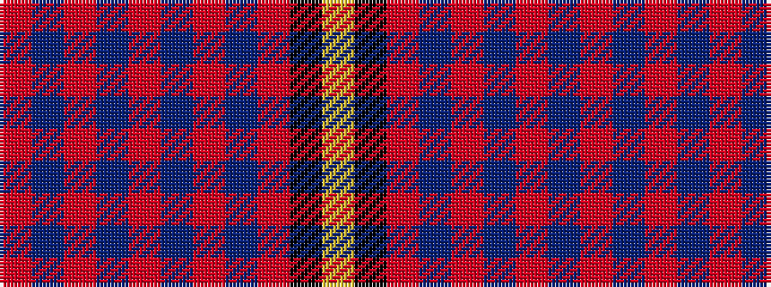

RBRBRBRBRKY

It is a 11 stripe tartan.

<figure class="pat-woven">

<figcaption>idealised sample</figcaption>
</figure>

## Colour Sequence



## Tartans with this colour sequence

| Tartans |
|---------------|
| [Stephens](/variants/s11/o9db4o2db4o2db15o9db4r18k9ly2~x2/)|
||
