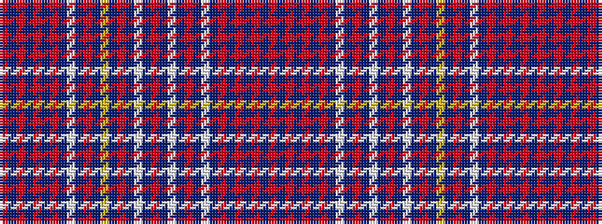

RBRBRBRBWBRBWBRBWBRBYBRBWBRBRBRBR

It is a 33 stripe tartan.

<figure class="pat-woven">

<figcaption>idealised sample</figcaption>
</figure>

## Colour Sequence



## Tartans with this colour sequence

| Tartans |
|---------------|
| [Kumikyoku - Wind of Thistle](/variants/s33/o38db3o5db3o5db3r13db3lt5db3r13db3lp5db3o12db3w5db3o12db3lg5db3r13db3lt5db3r13db3o5db3o5db3o36/)|
||
