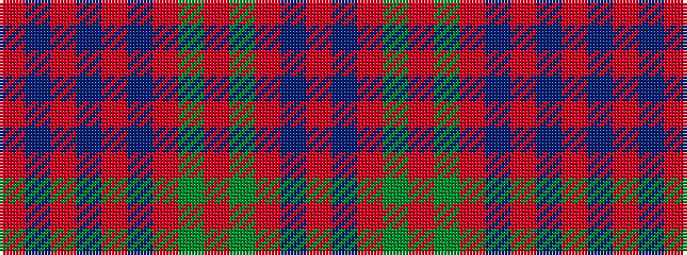

RBRBRBRGRGRBR

It is a 13 stripe tartan.

<figure class="pat-woven">

<figcaption>idealised sample</figcaption>
</figure>

## Colour Sequence



## Tartans with this colour sequence

| Tartans |
|---------------|
| [London, Caledonian](/variants/s13/r9db2r21t2r2db8r2g2r2g17r2db2r8~x2/)|
||
