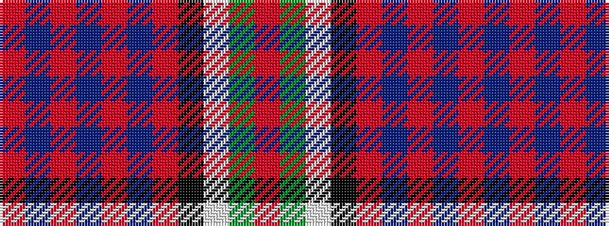

RBRBRBRKWGR

It is a 11 stripe tartan.

<figure class="pat-woven">

<figcaption>idealised sample</figcaption>
</figure>

## Colour Sequence



## Tartans with this colour sequence

| Tartans |
|---------------|
| [McLinden, Thomas (Personal)](/setts/s11/r3db1r1db2r12b1r1k4w1dg6r1~x4/)|
||
