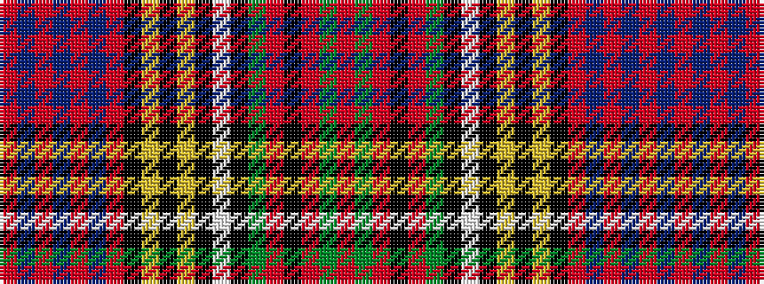

RBRBRBRKYKYKWKGRKRGR

It is a 20 stripe tartan.

<figure class="pat-woven">

<figcaption>idealised sample</figcaption>
</figure>

## Colour Sequence



## Tartans with this colour sequence

| Tartans |
|---------------|
| [Anderson of Kinnedar, hunting](/variants/s20/r8t10r4t14r8db10r5k9ly4k4ly4k7w8k8g36r2k4r2g8r6/)|
||
| [Anderson of Kinneddar Hunting](/variants/s20/r4t5r2t7r4db5r3k5ly2k3ly2k4w4k4g18r1k2r1g4r3~x2/)|
||
