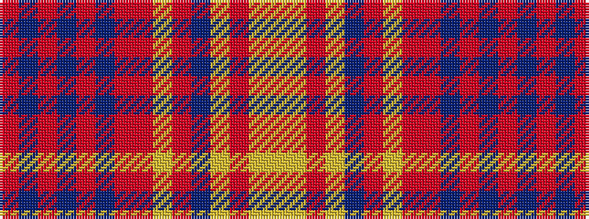

RBRBRBRRYRBYRYY

It is a 15 stripe tartan.

<figure class="pat-woven">

<figcaption>idealised sample</figcaption>
</figure>

## Colour Sequence



## Tartans with this colour sequence

| Tartans |
|---------------|
| [Strathdon (District?)](/variants/s15/lr3lo8ri2lo8db11ri2lo4r4ri27db1ri2db2ri2db13ri2~x2/)|
||
