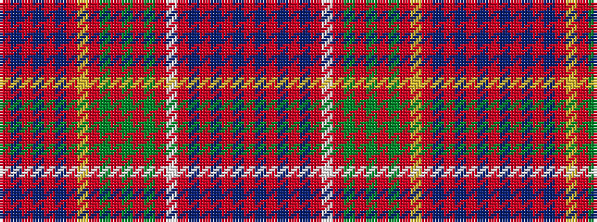

RBRBRBRWRGRGRGRYRBRBRBR

It is a 23 stripe tartan.

<figure class="pat-woven">

<figcaption>idealised sample</figcaption>
</figure>

## Colour Sequence



## Tartans with this colour sequence

| Tartans |
|---------------|
| [Fox, Red](/variants/s23/r7db6r3db4r3db11r18ly3r18g10r7g15r7g15r18lb3r18db11r3db4r3db6r7~x2/)|
||
