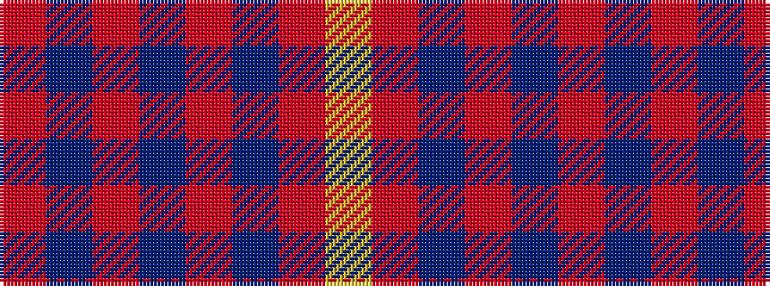

RBRBRBRY

It is a 8 stripe tartan.

<figure class="pat-woven">

<figcaption>idealised sample</figcaption>
</figure>

## Colour Sequence



## Tartans with this colour sequence

| Tartans |
|---------------|
| [Talladale](/variants/s8/o18dt2o2dt2o2dt14r14ly3~x2/)|
||
