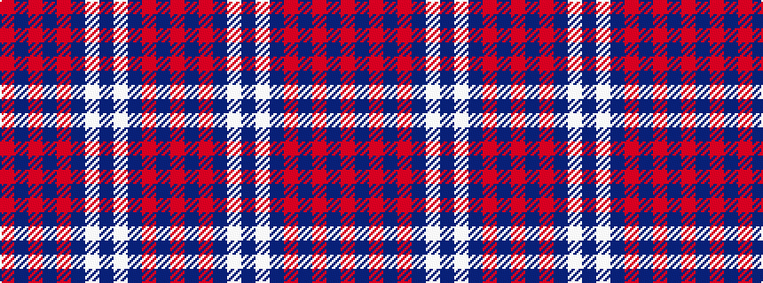

RBRBRBWBWBRBR

It is a 13 stripe tartan.

<figure class="pat-woven">

<figcaption>idealised sample</figcaption>
</figure>

## Colour Sequence



## Tartans with this colour sequence

| Tartans |
|---------------|
| [Brown, Watch dress](/variants/s13/o20dr3o3dr3o3dr9w10dr3w1dr9o10dr3o3~x2/)|
||
