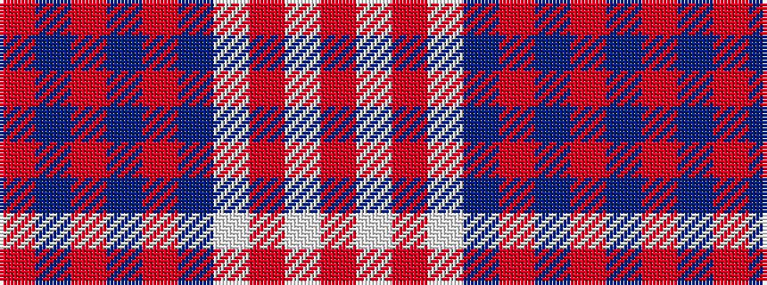

RBRBRBWRWR

It is a 10 stripe tartan.

<figure class="pat-woven">

<figcaption>idealised sample</figcaption>
</figure>

## Colour Sequence



## Tartans with this colour sequence

| Tartans |
|---------------|
| [Kalamazoo Caledonians](/setts/s10/m3db1m1db1m1db5lb1m1lb6m2~x4/)|
||
