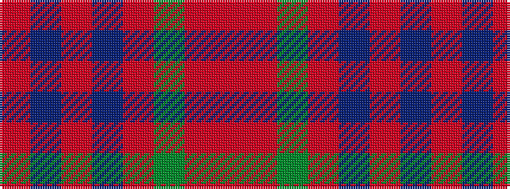

RBRBRGRR

It is a 8 stripe tartan.

<figure class="pat-woven">

<figcaption>idealised sample</figcaption>
</figure>

## Colour Sequence



## Tartans with this colour sequence

| Tartans |
|---------------|
| [Jardine of Castlemilk Family Tartan](/variants/s8/o9oi9y9oii1t1oi9t1oii1~x4/)|
||
