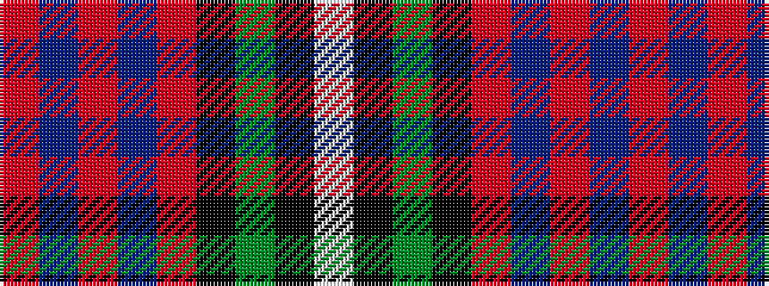

RBRBRKGKW

It is a 9 stripe tartan.

<figure class="pat-woven">

<figcaption>idealised sample</figcaption>
</figure>

## Colour Sequence



## Tartans with this colour sequence

| Tartans |
|---------------|
| [Celtic Women International](/setts/s9/r3db16m2db2m12k8g12k12w3~x2/)|
||
