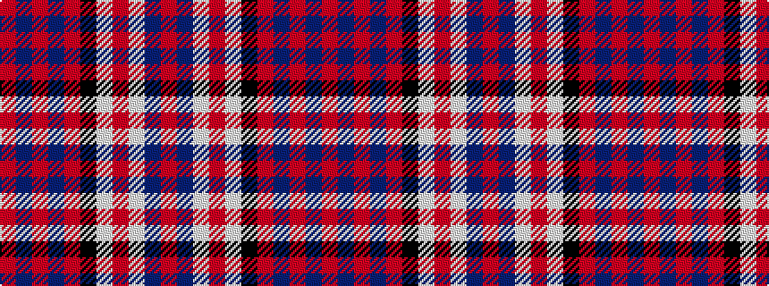

RBRBRKWRWBR

It is a 11 stripe tartan.

<figure class="pat-woven">

<figcaption>idealised sample</figcaption>
</figure>

## Colour Sequence



## Tartans with this colour sequence

| Tartans |
|---------------|
| [New York Caledonian Club Dress](/setts/s11/ri9db1ri2db3ri28k12lb1ri6lb1db6r1~x2/)|
||
