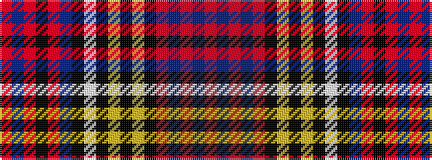

RBRBRKYKYKWKBRKRBR

It is a 18 stripe tartan.

<figure class="pat-woven">

<figcaption>idealised sample</figcaption>
</figure>

## Colour Sequence



## Tartans with this colour sequence

| Tartans |
|---------------|
| [Anderson Blue (Westwood)](/setts/s18/r4b5r2b7r10k4lo2k2lo2k4lb4k4b18r1k2r1b4r3~x2/)|
||
| [Anderson Red (Westwood) (Estimated threadcount)](/setts/s18/r4t5r2t7r10k4lo2k2lo2k4w4k4t18r1k2r1t4r3~x2/)|
||
