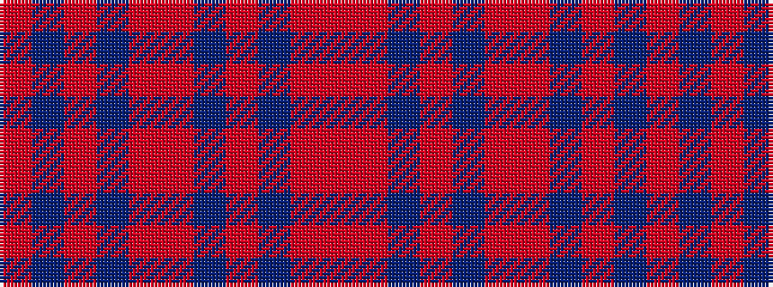

RBRBRRBRBRR

It is a 11 stripe tartan.

<figure class="pat-woven">

<figcaption>idealised sample</figcaption>
</figure>

## Colour Sequence



## Tartans with this colour sequence

| Tartans |
|---------------|
| [Kirtle](/variants/s11/r42ri10n2ri2db2ri2r10db6ri2db3r2~x2/)|
||
