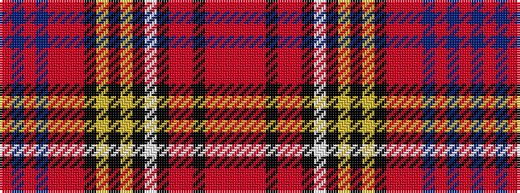

RBRBRRRKYKYKWKRRKRRR

It is a 20 stripe tartan.

<figure class="pat-woven">

<figcaption>idealised sample</figcaption>
</figure>

## Colour Sequence



## Tartans with this colour sequence

| Tartans |
|---------------|
| [Westwood Red Anderson (Fashion)](/setts/s20/r5b6r2b9r4r6r4k5lo2k2lo2k5w5k5r23r1k2r1r5r4~x2/)|
||
