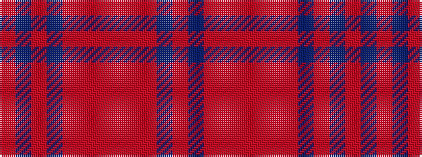

RBRBRRRRRRBR

It is a 12 stripe tartan.

<figure class="pat-woven">

<figcaption>idealised sample</figcaption>
</figure>

## Colour Sequence



## Tartans with this colour sequence

| Tartans |
|---------------|
| [Drumbeg](/variants/s12/o12n3o3dt4o16r3o3r3o3r16dt52o4/)|
||
