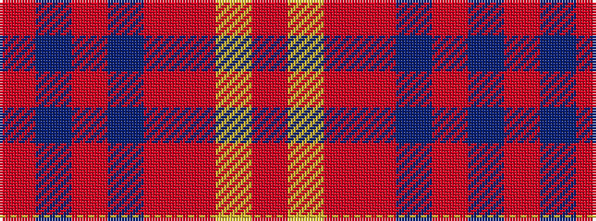

RBRBRRYR

It is a 8 stripe tartan.

<figure class="pat-woven">

<figcaption>idealised sample</figcaption>
</figure>

## Colour Sequence



## Tartans with this colour sequence

| Tartans |
|---------------|
| [Oakwood Purple (Fashion)](/variants/s8/r13db2r2db2r4m10lr2m2~x4/)|
||
