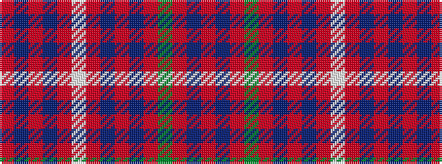

RBRBRWRBRBRGRBR

It is a 15 stripe tartan.

<figure class="pat-woven">

<figcaption>idealised sample</figcaption>
</figure>

## Colour Sequence



## Tartans with this colour sequence

| Tartans |
|---------------|
| [Grant](/setts/s15/r6db2r2dg24r2db2r2db8r2lb1r32db2r2db1r6~x2/)|
||
