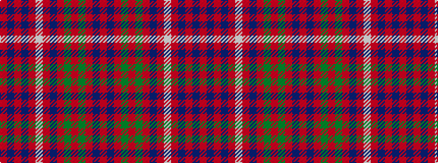

RBRBRWRBRGRGRBR

It is a [15 stripe pattern](/stripes/stripes15/) — every 15-stripe pattern is gathered there.

<figure class="pat-woven">

<figcaption>idealised sample</figcaption>
</figure>

## Colour Sequence



## Tartans with this colour sequence

This pattern is a design lineage: every tartan below shares one colour order, whatever its owner —
near-identical designs are grouped, the largest lineage first (#112: the pattern is a tartan's
second parent, beside its family or clan).

<table class="sett-table">
<tbody>
<tr><td><a href="/tartans/d/dr/drummond-7/">Drummond</a></td></tr>
<tr><td class="sett-swatch"></td></tr>
<tr><td><a href="/tartans/g/gr/grant-or-drummond/">Grant or Drummond</a> <small class="dt">ΔTartan 0.10</small></td></tr>
<tr><td class="sett-swatch"></td></tr>
<tr><td><a href="/tartans/d/dr/drummond-of-megginch/">Drummond of Megginch</a> <small class="dt">ΔTartan 0.47</small></td></tr>
<tr><td class="sett-swatch"></td></tr>
<tr><td><a href="/tartans/g/gr/grant-and-drummond/">Grant and Drummond</a> <small class="dt">ΔTartan 0.69</small></td></tr>
<tr><td class="sett-swatch"></td></tr>
<tr><td><a href="/tartans/g/gr/grant-of-ballindalloch/">Grant of Ballindalloch</a> <small class="dt">ΔTartan 0.80</small></td></tr>
<tr><td class="sett-swatch"></td></tr>
<tr><td><a href="/tartans/g/gr/grant-d/">Grant D</a> <small class="dt">ΔTartan 0.85</small></td></tr>
<tr><td class="sett-swatch"></td></tr>
<tr class="cluster-sep"><td></td></tr>
<tr><td><a href="/tartans/g/gr/grant-3/">Grant</a> <small class="dt">ΔTartan 2.23</small></td></tr>
<tr><td class="sett-swatch"></td></tr>
</tbody>
</table>

